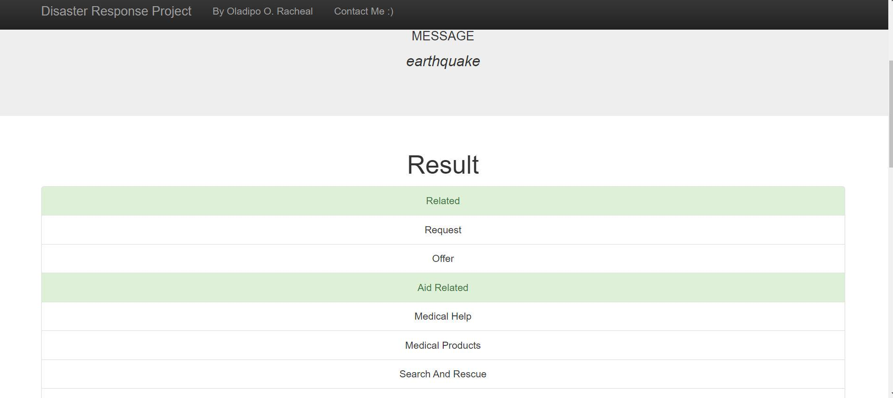

# Disaster Response Pipeline
Analysis of disaster data (from company Figure Eight) to build a model for an API that classifies disaster messages.

Dataset containing real messages that were sent during disaster events were analyzed. Then, a machine learning pipeline to categorize these events was created; so that workers can send the messages to the appropriate disaster relief agency suited for the particular emergency.

This project includes a web app where an emergency worker can input a new message and get classification results in several categories. The web app also displays visualizations of the data. 

## Table of Contents
- Libraries and Installation
- Project Motivation
- File Description
- Results
- Acknowledgements

### Libraries and Installation
This notebook is written in Python 3*. 
In order to run this notebook, Python Anaconda distribution is required. 
All libraries used are in Anaconda / the following libraries must be installed:
- Scikit-learn
- NLTK
- Numpy
- Pandas
- SQLAlchemy
- Flask
- Plotly 

### Project Motivation
During emergency events, the speed and exactness at which aid is provided is very important. Not all messages received by the company are  relevant. It is necessary to classify these messages properly, so that help can be dispensed speedily and accurately to the relevant persons in need.

### File Description
    - app
    | - template
    | |- master.html  # main page of web app
    | |- go.html  # classification result page of web app
    |- run.py  # Flask file that runs app

    - data
    |- disaster_categories.csv  # data to process 
    |- disaster_messages.csv  # data to process
    |- process_data.py
    |- InsertDatabaseName.db   # database to save clean data to

    - models
    |- train_classifier.py
    |- classifier.pkl  # saved model 

- README.md
- ETL and ML preparations

### Instructions
1. Run the following commands in the project's root directory to set up your database and model.

    - To run ETL pipeline that cleans data and stores in database 
    'python data/process_data.py data/disaster_messages.csv data/disaster_categories.csv data/DisasterResponse.db'
    - To run ML pipeline that trains classifier and saves 
    'python models/train_classifier.py data/DisasterResponse.db models/classifier.pkl'
2. Run the following command in the app's directory to run your web app. python run.py

3. Go to http://0.0.0.0:3001/

### Results
The web app looks like this. Type a message text (e.g earthquake) and get a classification report

### Acknowlegement
[Figure Eight](https://appen.com/about-us/) for the data.